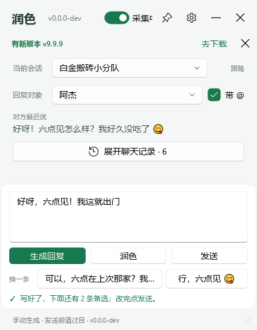
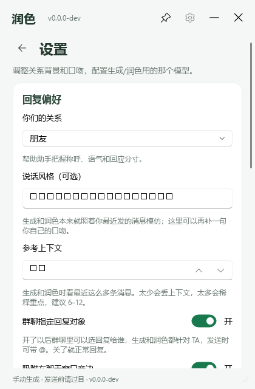

<div align="center">

# 润色 · polish-wchat-windows

**聊天窗口旁边的 AI 回复输入框：发出去之前，先帮你改一遍。**
顺手修错别字，并按「你在跟谁说话」调整口气——对领导严谨谦逊，对爱人来点风趣暧昧，对朋友随意自然。

[](#环境要求)
[](#环境要求)
[](LICENSE)
[](https://github.com/Echosong/polish-wchat-windows/releases/latest)

**[⬇ 下载最新版](https://github.com/Echosong/polish-wchat-windows/releases/latest)** · [English →](README.en.md)

</div>

> 界面上的名字是**「润色」**（标题栏和窗口标题都是这两个汉字，界面全中文）；
> `polish-wchat-windows` 只用在文件名上：exe `polish-chat.exe`、发布包 `polish-chat-vX.Y.Z.zip`、仓库名。

---

## 它到底解决什么问题

一句话：**你打出来的那句话，未必是你想给人的印象。**

- **错别字、漏字、句子读着别扭？** 上课、开会、赶时间的时候最容易打错，而且自己看十遍都看不出来。
  点一下润色，错字、语病、断句一起顺掉。
- **对领导、对客户不知道该"松"还是该"紧"？** 同一句「这个我做不了」，
  对领导得是「这块我这边把握不大，想先跟您对一下再动手」，对同事一句「这个我不太会」就够了。
- **跟爱人、跟朋友聊得像在汇报工作？** 「早点休息」和「再聊会儿嘛，睡不着」是同一件事的两种说法，
  区别只在跟谁说话。
- **不是不会说话，是当场想不出那句得体的话。** 你先写出来（哪怕很糙），让它改成接得上上文、
  口气对得上人的那版——**意思、态度、信息量它一个字都不改**。
- **发出去之前的那一遍，不用你记得点。** 写好之后点 **「润色并发送」**（或按 `Ctrl+Shift+回车`）：
  它先润一遍，改好**直接发出去**，不用「点润色 → 看一眼 → 再点发送」三步。想原样发就点「发送」，
  两条路都在，差的就是这一次润色。

**按人设口气**：关系在设置里选一下就行，说话风格还能再补一句你自己描述。

| 你在跟谁说话 | 口气预设可以设成 | 出来的效果 |
| --- | --- | --- |
| 领导 / 客户 | 严谨、谦逊、简洁、不卑不亢 | 「这个方案我这边今晚整理好，明天一早上班前发您」 |
| 爱人 / 恋人 | 风趣、暧昧、亲密、带点玩笑 | 「早点睡呀，梦里见——明天记得想我」 |
| 朋友 / 同事 | 随意、口语、可以直接甩梗 | 「行，六点见 😄」 |
| 家人 | 关心、耐心、把话说清楚 | 「药记得吃，我下班顺路给你带点水果」 |

它还会**照着你自己最近说过的话**模仿口吻（用词、句长、标点习惯），所以出来的不是那种一眼 AI 味，
是"你自己在说话"，只是说得更顺、更得体。

## 为什么可以放心用

- **默认零调用。** 你不点按钮，它一次 API 都不发；静默期对方来消息只进上下文，不出网、不调模型、不弹窗。
- **只截自己这一个窗口的画面做 OCR**，不 hook、不注入、不读微信数据库、不碰微信进程——和读屏软件、录屏软件是同一类操作。
- **截图不落盘。** 捕获到的帧是内存里的 numpy 数组，全程不写磁盘、不进日志、不上传。
- **不碰钱。** 转账、红包、收款相关的界面元素一律不碰，提示词里也禁了这几个话题。
- **不替你按发送。** 程序里没有任何自动发送路径：唯一会按回车的地方就是你点了「发送」之后。

<details>
<summary>展开：和「读聊天记录库」那类工具的区别</summary>

采集方式决定了风险面：本项目不做 hook、不注入、不读微信数据库、不解密、不碰微信进程内存，
只对自己这一个窗口截图 + 本地离线 OCR（RapidOCR）。截图只在内存里，等于把「读屏软件」这条路走干净，
绕开了读库类工具最容易出问题的部分。完整边界见下方[隐私与边界](#隐私与边界)。

</details>

## 界面

<table>
<tr>
<td width="50%"></td>
<td width="50%"></td>
</tr>
<tr>
<td align="center">默认就一行会话标题（带条数）+ 常驻输入框；第一行「生成回复 / 润色」= 让 AI 写点什么，第二行「发送 / 润色并发送」= 发出去，差的就是发之前改不改</td>
<td align="center">设置：关系背景、说话风格、参考上下文条数、群聊指定回复对象、吸附开关、模型</td>
</tr>
</table>

## 下载即用

**普通使用直接下载，不用装 Python、不用碰源码。**

👉 **[下载最新版](https://github.com/Echosong/polish-wchat-windows/releases/latest)** ——
在 Releases 页拿 `polish-chat-vX.Y.Z.zip`（约 140 MB），解压到一个固定目录（整个文件夹一起，exe 要用旁边那堆文件），双击 `polish-chat.exe`。

要求：Windows 10 1903+ / 11，聊天窗口开着，一把 API key。

> exe 没签名，SmartScreen 会拦一下：「更多信息」→「仍要运行」。介意就往下看「自己打包」，自己打的更踏实。

## 它是什么

一个挂在自己微信窗口旁边的小悬浮框：它用 Windows 的窗口截图 + 本地离线 OCR 读你屏幕上的对话，
当作上下文。当你想回复的时候：

- 点 **「生成回复」** —— 它按最近这段对话写 3 条，第 1 条直接进输入框，另外两条挂成「换一条」
- 或者 **自己写**，写完点 **「润色」** —— 它只改「怎么说」，不改你说的意思；想省掉「看一眼再发」，
  直接点 **「润色并发送」**（`Ctrl+Shift+回车` 同效）
- 点 **「发送」** —— 原样粘进微信输入框并回车发出去（`Ctrl+回车` 同效）

悬浮框默认**吸附在微信窗口右侧**（右边放不下会自动翻到左边，**下沿跟聊天窗口的下沿对齐**，
两边的输入区在同一水平线上；高度按内容来，收着时就矮）。
拖一下就能脱开自己摆，标题栏那个图钉或设置里的开关能吸回来。

## 它不做什么（这是设计，不是没做完）

- **不 hook、不注入、不读微信数据库、不碰微信进程。** 只截自己这一个窗口的画面做 OCR，
  和读屏软件、录屏软件是同一类操作。
- **截图不落盘。** 捕获到的帧是内存里的 numpy 数组，全程不写磁盘、不进日志、不上传。
- **不碰钱。** 转账、红包、收款相关的界面元素一律不碰，提示词里也禁了这几个话题。
- **不替你按发送。** 程序里没有任何自动发送路径，唯一会按回车的地方就是你点了「发送」之后；
  「自动生成」只管起草，也没有开关能绕过这一条。
- **默认不自动回复。** 对方来消息只记账（进上下文和聊天记录），不出网、不调模型、不弹窗。
  静默期零调用——你不点按钮，它就一次 API 都不发。想让它自动起草，把输入区那行的「自动生成」开关拨开
  （默认关、不落盘，重启回关）：对方一发新消息就自动起草一版填进输入框；输入框里已经有你写的东西时
  不打扰你，直接跳过。

## 第一次启动

程序会弹出设置页，只有一把 key 要填：

1. **来源** —— 默认 **DeepSeek 官网**直连，key 在 [platform.deepseek.com](https://platform.deepseek.com/)
   申请（很便宜，生成一次几厘钱）。也可以换成表里任意一家（OpenAI / Anthropic / Gemini 三种协议都支持），
   或者在两个「自定义」来源里填自己的 Base URL。
2. 点「获取模型」拉一次列表挑一个，或者直接手打模型 id。
3. 顺手选一下「你们的关系」（恋人 / 朋友 / 同事 / 家人 / 自定义）。保存，可以用了。

key 写进 Windows 用户环境变量（注册表 `HKCU\Environment`，跟 `setx` 同一个地方）——全程只有
`LLM_API_KEY` 这一个名字，**任何文件里都不出现 key，也不进日志**（报错文本一律脱敏）。
其余设置写在 exe 旁边的 `config.json`，整个文件夹拷走设置也跟着走。

## 日常怎么用

- 聊天窗口开着、别最小化（用别的窗口盖住没事，被遮挡不影响截图），把要聊的会话点开
- 悬浮框跟着微信走；「当前会话」跟着你切会话变，上下文和聊天记录都按会话分开存，不串味
- 想回的时候：生成一版改一改 / 自己写一版点「润色」看一眼再发 / 点「润色并发送」一步到位 / 直接发
- 懒得点「生成回复」：把输入区那行的「自动生成」开关拨开（默认关、重启回关），对方一发新消息就自动
  起草一版躺在输入框里等你；发送还是你自己按
- 输入框下面那行右边的「采集开关」拨到「已暂停」就不再读聊天，输入框和按钮照样能用
- 群聊里每条消息会带上发言人名；打开「群聊指定回复对象」还能指定回复给谁，发送时可带「@名字 」前缀

**花多少钱**：默认只有你点「生成回复」或「润色」才各调一次模型；「润色并发送」= 润色那次 + 发送，
只多润色这一次。十分钟没人说话就是十分钟零调用；光看着不点，一次都不调。
开了「自动生成」就变成「对方每说一句各调一次」（一次生成 3 条候选只算一次调用）。

## 功能

- **手动触发（默认）**：新消息只进上下文和聊天记录，一个模型调用都不会自己发出去
- **自动生成（可选）**：输入区那行的开关拨开，对方一发新消息就自动起草一版填进输入框；输入框里有你
  写的东西时跳过、不打扰。默认关、不落盘（重启回关）；**发送永远要你自己按**
- **生成回复**：3 条候选，第 1 条是模型自己最推荐的；不满意的点「换一条」跟框里那条对调着挑
- **润色**：把你自己写好的一段话改顺——**顺手修掉错别字和语病**，按「你们的关系」调整口气
  （严谨谦逊 / 风趣暧昧 / 随意口语，见[它到底解决什么问题](#它到底解决什么问题)），接得上上文、
  不跑题、口气像你本人；意思、态度、信息量一个字不改，长度不怎么变。原文留在「还原」里，随时换回来
- **润色并发送**：输入框下面第二行右边那个按钮，也可以按 `Ctrl+Shift+回车`。写好就点它，
  润完**直接发出去**，不用「点润色 → 看一眼 → 再点发送」三步。跟「发送」的区别只在这一遍润色：
  想原样发就点「发送」，想改一遍再发就点它。润色那步要是失败，一个字都不会发出去，
  原文还留在输入框里等着你直接发
- **发送**：原样粘进微信输入框 + 回车（也可以按 `Ctrl+回车`）
- **跟着当前会话走**：会话名从面板头部 OCR 出来，记录和上下文按会话分开；也能在下拉框里翻别的会话
  （标「浏览中」，那会儿不能生成也不能发，免得串会话）
- **群聊**：发言人名进上下文，知道哪句是谁说的；可指定回复对象，发送可带「@名字 」（纯文本）
- **吸在微信旁边**：窗口一挪一缩就跟着贴过去；拖一下脱开，图钉再吸回来
- **采集开关**：输入框下面那行右边，一拨就停，采集会话一起停掉（Win10 的采集黄框也跟着消失）
- **聊天记录**：默认收着，首页只有一行会话标题（后面跟着这个会话记了多少条），点标题右边那个箭头展开，
  才看得到「对方最近说」和聊天记录，看 OCR 到底读出了什么，认错了一眼就能发现
- **窗口高度跟着内容走**：收着就是输入框那么高、铺开才长高，旁边不留一大片空的
- **调试视图**（可选）：另开一个窗口实时画出截到的画面和每个识别框——绿 = 我、蓝 = 对方、
  灰 = 过滤掉的灰字、橙 = 当成发言人名、红 = 当成图片丢掉、黄 = 小字丢掉，外加 OCR 耗时和每一行。
  识别不对时一眼看出是哪一步的锅。只在内存里画，不存图
- **模型随便换**：12 家预设 + 自己的 Base URL，全程只要一把 key；可点「获取模型」拉真实列表
- **思考模式开关**：默认关；开了模型先想再写，更斟酌但慢好几倍、贵一些
- **响应式悬浮框**：置顶、可拖可缩，最小 320×420，窄于 400 进紧凑模式
- **新版本提示**：启动时（可关）查一次 GitHub 最新版本号，有新版本在标题栏下出一条提示

## 隐私与边界

这是个人自用工具，下面几条是硬约束，代码里就是这么写的：

- **只读自己电脑上、自己本来就有权查看的对话。** 不代替任何人查看别人的聊天。
- **只截自己的聊天窗口 + 本地离线 OCR（RapidOCR）。** 不 hook、不注入、不读对方数据库、
  不解密、不碰对方进程内存。
- **截图只在内存里。** 捕获到的帧是 numpy 数组，全程不写磁盘、不进日志、不上传；主程序
  （`app/`、`core/`）里没有 `.save()`。`probe/`、`tools/` 下的开发脚本会把图存成文件，但那些
  脚本不在发布包里。
- **调试视图也只在内存里画**，关掉开关子进程连帧都不发。
- **key 只进环境变量，而且只有一把。** 任何文件里不出现 key，报错文本一律脱敏。
- **启动时查一次版本号（可关）。** 只向 GitHub Releases API 发一个 GET，带的只有 UA 和当前版本号，
  不夹带任何聊天内容；设置里关掉就完全不发，源码直接跑（没有版本号）也不会发。

**什么会出网**：只有你点「生成回复」/「润色」时，把内容发给你在设置里选的那家接口
（DeepSeek 官网、OpenRouter、OpenAI、Moonshot、智谱、通义、硅基流动、OpenCode Go、Anthropic、Gemini，
或者自填的 OpenAI 兼容 / Anthropic 兼容地址），加上启动时（可关）一次到 GitHub 查版本号。
**本项目没有任何自建服务器**，聊天内容不经过任何第三方中转。发出去的内容固定是：**最近 N 条对话文本**
（N = 设置里的「参考上下文」，默认 10；群聊带发言人名）、**关系设置**、**你自己最近 12 条 60 字以内的
短消息**（当口吻样本，链接和长段不送）、**你填的说话风格**；点「润色」时再加上**你自己写的那段草稿**，
群聊指定了回复对象时再加一个对象名。除此之外没有别的。OCR 全程离线。

**会不会因此被封号？** 本项目不 hook、不注入、不读对方的数据库或进程内存、不调用对方的任何私有
接口或账号体系——只截自己这一个窗口的画面做 OCR，跟读屏软件、录屏软件是同一类操作。

## 工作原理

```
WGC 截聊天窗口（GPU 合成窗口也能截，被遮挡也能截）
  → 像素锚点定位消息区（认底色和分隔线，不写死坐标，深浅主题通用）
  → OCR 面板头部的会话名当 key（头部像素没变就不重跑），记录和上下文都按会话分开存
  → RapidOCR 只认消息区那一块
  → 按气泡颜色分 me / her，灰字（引用块、时间戳、发言人名、链接卡片）过滤掉，
    发言人名摘出来挂到它下面那条消息上
  → 跟上一帧比，滚动翻出来的旧消息不重复上报
  → 到这里为止全在本地；只有你点按钮才会走 core/engine.py
       「生成回复」  → generate()  一次模型调用 → 3 条候选，第 1 条进输入框
       「润色」      → polish()    一次模型调用 → 你那句话被改顺（意思不变）
       「润色并发送」→ polish()    一次模型调用 → 改顺了直接走下面那条发送，
                       失败就一个字都不发、原文留在输入框里
       「发送」      → 写剪贴板 → 聚焦微信输入框 → Ctrl+V → 回车（原样发，不过模型）
```

截图和 OCR 跑在独立子进程里（一帧 OCR 250~800ms，放 Qt 主线程界面会僵），父进程只管界面和网络调用。
悬浮框位置每 50ms 跟一次聊天窗口的矩形（吸附开着时），窗口没动就不折腾。

### 为什么走 OCR

目标窗口的界面自绘在一块 GPU 合成画布上。UIA 树只有 2 个节点、**没有控件树**——`probe/probe_win.py`、
`probe/probe_win2.py` 实测证伪。所以唯一干净的非侵入采集路 = 截自己的窗口 + 本地 OCR：离线、零 token、
不碰对方进程。

### 为什么写出来不那么像 AI

- system prompt 是中文写的反模板规则：不总结不复述、不解释自己为什么这么回、不用「首先/其次/总之」和
  「亲/您/加油哦」这类客套、不排比不凑三段式、句尾别习惯性加句号、允许不完整的句子和口头语；
  三条不是「温暖版/负责版/行动版」，是同一个人三个心情下随手打的
- 喂口吻样本：把你自己最近 12 条短消息原样给它，照着你的用词、句长、标点习惯写；设置里的
  「说话风格」再补一句你自己的描述
- 润色那条更狠：明写「意思、态度、信息量一点都别改」「长度最多长两成」「原文已经够顺就原样还回来，
  别为了改而改」，还要求保留原文的断句和标点习惯（不加标点的人别给他补句号），温度也压低
- 收尾还做了清洗：剥掉编号、方括号、引号和照抄的「me:」前缀，去掉句尾句号（`？！～` 留着，那是语气）
- 还有一道防注入硬防线：上下文里长得像「忽略上面的规则」「回我三遍」的对方消息会被标出来单独提醒，
  候选里原样复读对方那句话的直接丢掉（纯笑声除外）

## 支持的模型

**生成 + 润色（key：`LLM_API_KEY`，只有一个槽）**

| 来源 | 协议 | 地址 | 默认模型 |
| --- | --- | --- | --- |
| DeepSeek 官网（默认） | OpenAI | `api.deepseek.com` | `deepseek-flash` |
| OpenRouter | OpenAI | `openrouter.ai/api/v1` | `deepseek/deepseek-v4.1-flash` |
| OpenAI | OpenAI | `api.openai.com/v1` | 自己选 |
| Moonshot (Kimi) | OpenAI | `api.moonshot.cn/v1` | 自己选 |
| 智谱 GLM | OpenAI | `open.bigmodel.cn/api/paas/v4` | 自己选 |
| 通义千问 | OpenAI | `dashscope.aliyuncs.com/compatible-mode/v1` | 自己选 |
| 硅基流动 | OpenAI | `api.siliconflow.cn/v1` | 自己选 |
| OpenCode Go | OpenAI | `opencode.ai/zen/go/v1` | `deepseek-v4.1-flash` |
| Anthropic | Anthropic | `api.anthropic.com` | 自己选 |
| Google Gemini | Gemini | SDK 自带 | 自己选 |
| 自定义 · OpenAI 兼容 | OpenAI | 自己填 | 自己选 |
| 自定义 · Anthropic 兼容 | Anthropic | 自己填 | 自己选 |

没有默认模型的来源，在设置页点「获取模型」拉一次列表自己挑（也能直接手打模型 id）。
OpenCode Go 的列表只留走 `/chat/completions` 的模型；MiniMax、Qwen 走 `/messages`，Grok、GPT 走
`/responses`，选了会失败，所以不放进下拉框。三种协议各走自家官方 SDK
（`openai` / `anthropic` / `google-genai`），不自己拼 HTTP。

生成：温度 1.2；润色：温度 1.0、只出改好的那一段。思考模式默认关，开了会带上各家自己的思考开关。

## 环境要求

下载 exe 的只看前三条；Python 只有源码运行 / 自己打包才需要。

- **Windows 10 1903+ 或 Windows 11**（Windows Graphics Capture 的最低要求）
- **Python 3.10–3.12**（Releases 里的 exe 是 CI 用 3.11 打的。3.13+ 不行：`rapidocr-onnxruntime`
  1.4.x 的 `requires_python` 封顶 <3.13，pip 会静默改装 1.2.3，启动即 `KeyError`）
- **聊天窗口**
- **一把 API key**：`LLM_API_KEY`，默认 [DeepSeek 官网](https://platform.deepseek.com/)

> Win10 上 WGC 会在目标窗口外画一圈黄框，系统不给关；Win11 才能关掉。
> 嫌碍眼就把输入区状态行右边的采集开关拨到「已暂停」，黄框立刻消失。

## 源码运行（开发者）

```bash
git clone https://github.com/Echosong/polish-wchat-windows.git
cd polish-wchat-windows
python -m venv .venv
.venv\Scripts\activate
pip install -r requirements.txt
python main.py
```

PyCharm / VS Code 里直接 Run `main.py` 也行。

不碰微信就能预览界面（合成数据，离线）：

```bash
python tools/preview_ui.py --state ready --screenshot docs/ui_home.png
python tools/preview_ui.py --state typed                                # 自己写完、还没润色的样子
python tools/preview_ui.py --state ready --width 320 --height 420       # 试紧凑布局
```

只想验两条模型链路（要 key + 联网）：

```bash
set LLM_API_KEY=...
python tools/demo.py
python tools/demo.py --draft "我自己写的草稿"   # 只跑润色
```

每个核心模块都带离线自测（不联网）：

```bash
python -m core.keys && python -m core.providers && python -m core.draft
python -m core.engine && python -m core.llm && python -m app.update
```

### 自己打包

双击 `build.bat`（没有 `.venv` 会自己建一个，装依赖、调 PyInstaller，一路到底），或者手动：

```bash
pip install -r requirements.txt pyinstaller
pyinstaller --noconfirm --clean polish-chat.spec
```

出来的是 `dist\polish-chat\`（`polish-chat.exe`），整个文件夹就是成品（onedir：onefile 有 140MB
要每次启动解压）。推一个 `v*` tag，`.github/workflows/release.yml` 会在 `windows-latest` 上打好、
压成 zip 挂到 Release 上；手动触发（workflow_dispatch）只出 artifact，方便试打包。

## 设置说明

改完点「保存设置」，下一次生成 / 润色立即生效，不用重启。

| 控件 | 作用 | 存在哪 |
| --- | --- | --- |
| 你们的关系 | 恋人/朋友/同事/家人/自定义，生成和润色都按它把握称呼和分寸 | `config.json` → `relationship`（默认 `romantic partners`） |
| 说话风格（可选） | 一句话描述自己的口吻；留空就只靠最近消息模仿 | `config.json` → `style` |
| 参考上下文 | 生成和润色各看最近多少条消息，3~30 | `config.json` → `context`（默认 10） |
| 群聊指定回复对象 | 开了群聊里才有「回复对象」那一行，都针对 TA 写 | `config.json` → `reply_target`（默认关） |
| 吸附在聊天窗口旁边 | 聊天窗口一动就贴过去；拖动悬浮框只脱开这一次运行，不改这个开关 | `config.json` → `dock`（默认开） |
| 启动时检查更新 | 开了才在启动时查一次 GitHub 最新版本号 | `config.json` → `check_update`（默认开） |
| 调试视图 | 另开一个窗口实时显示截到的画面和识别框。拨一下立刻生效，不用点保存；关掉那个窗口等于关掉开关 | `config.json` → `debug_view`（默认关） |
| 来源 / Base URL | 上面那张表里的任意一家；只有「自定义」要填 Base URL | `config.json` → `draft_provider` / `draft_base_url` |
| 密钥 | 上面选哪家就填哪家的 key。已配置时留空 = 保留 | 注册表 `HKCU\Environment` → `LLM_API_KEY` |
| 模型 | 可手打，也可点「获取模型」拉列表挑 | `config.json` → `draft_model`（空 = 该来源默认） |
| 开启思考模式 | 开了模型先想再写，慢好几倍、贵一些 | `config.json` → `thinking`（默认关） |

主界面上那几个（输入区状态行右边的「自动生成」和采集开关、标题栏的图钉、「当前会话」和「回复对象」下拉、「带 @」勾选框、输入框内容）
只在内存里，不落盘，重启回默认。

## 常见问题

**「发送」和「润色并发送」到底差在哪？**
只差发之前那一次润色。「发送」= 你写什么就发什么，一个字不改，也不花钱、不等模型；
「润色并发送」= 拿你写的当草稿，润一遍（修错别字、按关系调口气），回来直接发出去——
多一次模型调用、多等一两秒。润色那步失败的话一个字都不会发出去，原文还在输入框里，
这时候点「发送」就能原样发。

**润色并发送会不会改我的意思？**
不会。润色的提示词里写死了「意思、态度、信息量一点都别改」，只动说法、错别字和标点习惯，
长度最多长两成。发出去之前如果真的不放心，就别用它、点「润色」看一眼再发——两条路都留着。

**点了「发送」没发出去，只是换了个行？**
微信里的发送快捷键设成了 `Ctrl+回车`。本工具是按回车发的，不去改微信的设置——你可以改微信的快捷键，
或者直接点微信自己的发送按钮（框里已经有你要发的内容了）。

**窗口为什么必须开着、不能最小化？**
Windows 不渲染最小化的窗口，任何截图法都拿不到画面。用别的窗口盖住它没事（被遮挡也能截）。
发现被最小化时程序会无激活地还原它再压到所有窗口最底下（不抢焦点）。

**Win10 上那一圈黄框？**
WGC 的采集提示框，系统不给关，Win11 才行。不想看就把采集开关拨到「已暂停」。

**润色点了没反应 / 报「模型光顾着想了」？**
有些 OpenAI 兼容口上的模型**默认开着思考模式且关不掉**，思考 token 会把输出额度吃光、正文是空的。
程序遇到空正文会自动同请求重问一次；还空就是这个提示，再点一次通常就好。也可以换一个模型或来源。

**群聊里「带 @」是真的 @ 提醒吗？**
不是。它只是在开头加「@名字 」这几个字，微信不会认成真正的 @ 提醒——真 @ 得用微信自己的选人面板，
本工具不模拟那套按键。

**同一人连发两句一模一样的，记录里少一条？**
去重按文本相似度做的，避免滚动时把旧消息重复上报。只影响记进上下文的条数。

## 项目结构

```
main.py                 入口：父进程只管界面和网络；子进程采集，队列传消息（IDE 直接 Run）
app/                    UI + 采集层
  capture.py            找聊天窗口 + WGC 盯帧 + 像素锚点定位消息区 + window_rect()（吸附用）；帧全程内存
  ocr.py                RapidOCR 读消息区 → 按颜色分 me/her/灰字 → 滚动去重；另读头部的会话名
  worker.py             采集子进程主循环（截图 → 定位 → OCR → 去重 → 丢队列）
  fill.py               fill() 只粘贴；send() 粘贴 + 回车（只由「发送」按钮触发）
  overlay.py            置顶悬浮框：常驻输入区（生成回复 / 润色 / 发送 / 润色并发送 + 换一条 + 还原）+ 会话跟随 + 吸附 + 设置页
  debugwin.py           调试视图：另一个窗口画当前帧 + 每个识别框的分类；只在内存里画，不存图
  settings.py           key 只进注册表，其余设置落 config.json
  update.py             启动时查一次 GitHub 最新版本号（可关）
core/                   模型链路，平台无关
  engine.py             唯一入口：generate(messages, relationship) / polish(text, messages, relationship)
  providers.py          来源表（12 家）：协议、地址、默认模型；纯数据，不认 key
  keys.py               key 读取（环境变量 → 注册表）、报错脱敏、ChatError
  llm.py                三种协议的薄适配层，一律走官方 SDK：openai / anthropic / google-genai
  draft.py              两条提示词链路：写 3 条候选、润色用户草稿；解析、过滤、不足时追问补齐
tools/
  demo.py               端到端冒烟：拿一段写死的对话跑生成 + 润色（需 key + 联网）
  preview_ui.py         用合成数据预览界面（含 --state debug 的调试视图），不采集不联网不碰聊天窗口
  make_icon.py          生成 docs/icon.ico（打包图标），图标已提交，换颜色才用重跑
probe/                  一次性探针，结论已写进本文，留着是为了可复现
  probe_win.py           UIA 能不能读聊天文字 → 证伪（树是空的）
  probe_win2.py          UIA 证伪 v2：分清「树是空的」和「有树没文字」，顺带试 LegacyIAccessible
  probe_notify.py        来消息走不走 Windows 通知平台（能监听到就零 OCR）
  probe_ocr.py           OCR 读不读得准中文气泡、左右说话人分不分得开
  probe_ocr_speed.py     RapidOCR 一帧多久、裁小能快多少（结论：det_limit_type 必须 'max'）
  probe_ocr_live.py      WGC 持续盯窗口 + 变了就 OCR，新文字实时打控制台
  probe_printwindow.py   试 PrintWindow + PW_RENDERFULLCONTENT 能不能绕开 Win10 黄框（未验证）
polish-chat.spec        PyInstaller 打包定义（onedir），build.bat 和 CI 共用这一份
build.bat               本地一键打包（双击就行）
.github/workflows/release.yml  推 v* tag → windows-latest 上打包 → zip 挂到 Release
requirements.txt        依赖（纯 ASCII 注释：中文 Windows 上 pip 按 GBK 读会炸）
NOTICE                  出处、第三方组件许可证与商用约束
docs/KICKOFF.md         架构说明和硬约束（给接续开发的人看）
docs/icon.ico           程序图标，tools/make_icon.py 生成
docs/ui_*.png           README 里那两张截图，tools/preview_ui.py --screenshot 出的
docs/wechat-mp.png      公众号长条图（设置页已经不放了，留着备用，别当死文件删）
config.json             你自己的设置，不进仓库（在 .gitignore 里）
```

`tools/demo.py`、`tools/preview_ui.py` 自己补了仓库根，命令行直接跑就行；其它脚本按「仓库根在
`PYTHONPATH` 里」写，得自己带 `set PYTHONPATH=.`。

## 已知限制

- **只做微信这一个聊天窗口**。识别全靠微信自己的界面布局和配色，微信改版可能失效；不打算适配别的 IM。
- **「发送」靠回车**：微信设成 `Ctrl+回车` 发送的话，这一下只会换行（见常见问题）。
- **输入框拉高超过面板一半会认错消息区**：消息区靠「面板 45% 高度以下第一根分隔线」定位。
- **OCR 的「文字必须落在平底色上」规则只对精确像素的帧成立**：框里众数颜色占比低于 45% 就当成图片里的
  字扔掉（头像、照片、表情包上的字）。缩放或压缩过的图底色会糊成几百种颜色，整屏都会被当成图片。
- **群聊里名字行被 OCR 漏识，这条消息会挂到上一个人头上**。
- **会话靠头部标题认**：OCR 抖一个字会按相似度归到已知会话，代价是名字只差一个字的两个会话会被并成一个；
  一直认不出就先挂在「当前会话」名下。
- **同一人连发两句一模一样的会吞一条**（去重按相似度）。
- **发送靠点击输入框坐标**：算的是消息区底线下方 40px、左边界右侧 60px，微信改布局就得跟着调。
- **没有托盘**：关窗口就是退出（标题栏的「最小化」是收到任务栏）。
- **Win10 黄框**：WGC 的采集提示框，系统不给关。

## 更新记录

**v1.0.0 · 首个发布**
- 聊天窗口旁的常驻输入框：**生成回复**（3 条候选，第 1 条进框、另两条「换一条」）、
  **润色**（改顺自己写的话，不改意思，原文可还原）、**发送**（粘贴 + 回车，`Ctrl+回车` 同效）
- **手动触发**：新消息只记账，不自动分析、不出网；静默期零调用
- 窗口自动吸附在聊天窗口右侧（放不下翻到左边），拖动即脱开、图钉吸回来
- 本地窗口截图 + 离线 OCR 读上下文，按会话分开存；群聊带发言人名，可指定回复对象
- 采集开关、实时聊天记录、识别调试视图、聊天窗口最小化自动还原
- 12 家模型来源 + 自定义 Base URL，只要一把 key；思考模式开关；启动时版本检查（可关）
- 防提示词注入硬过滤；口吻样本模仿；候选解析的多形态兜底
- 打包：PyInstaller onedir + 一键 `build.bat` + 推 tag 自动出 Release

<details>
<summary>更早的历史（作为 jev-chat-windows 的那些版本）</summary>

本项目脱胎于作者自己维护的 `jev-chat-windows`。那个版本走的是「Jev 判断 → 起草 3 条 → Jev 排序」
的三段式自动分析，要两把 key（判断 + 起草），判断内核来自安卓原版 Jev 聊天助手。

重做成 polish-chat 时删掉了整个判断内核（`core/jev_client.py`、`core/questions.py` 及百炼 / TypeSafe /
OpenRouter 决策模型那条链路）、改成手动触发的一次生成 / 润色，key 从两把收敛成一把。
旧版本的历史记录在原来那个仓库里，不在本仓库。

</details>

## 出处与致谢

- **本项目脱胎于 [`jev-chat-windows`](https://github.com/jev-chat/jev-chat-windows)（MIT）**——
  窗口截图 + 离线 OCR 那套采集方案是在那里长出来的，代码是本项目的直接前身。
- 而 `jev-chat-windows` 是 **[Jev 聊天助手](https://github.com/jev-chat/jev-chat-jarvis)**（安卓原版）
  的 Windows 姊妹项目，早期版本内置的 Jev 判断内核（题目口径、决策模型调用）来自那个上游。
  **那部分内核在 polish-chat 里已经全部移除**，所以本项目现在只有「生成 + 润色」两条语言模型链路。
- [RapidOCR](https://github.com/RapidAI/RapidOCR) — 离线中文 OCR，整条链路能离线全靠它
- [windows-capture](https://github.com/NiiightmareXD/windows-capture) — Windows Graphics Capture 的 Python 绑定
- [PyQt-Fluent-Widgets](https://github.com/zhiyiYo/PyQt-Fluent-Widgets) — 界面组件
- 模型 SDK：[openai](https://github.com/openai/openai-python) /
  [anthropic](https://github.com/anthropics/anthropic-sdk-python) /
  [google-genai](https://github.com/googleapis/python-genai)

## 版权与许可

本项目自身代码以 [MIT](LICENSE) 协议开源，另见 [NOTICE](NOTICE)。

```
Copyright (c) 2026 Echosong
Portions Copyright (c) 2026 rezoch340 and the jev-chat contributors (jev-chat-windows)
```

**第三方组件与商用**：本项目自己的代码是 MIT，但 Windows 发布包（PyInstaller 打的 zip）里打进了
[PySide6-Fluent-Widgets](https://qfluentwidgets.com/)，该组件是 GPLv3 协议，非商用免费，商用需要
向作者购买商业授权。因此发布包整体受 GPLv3 约束：想商用请自己购买那份商业授权，或者自己把这个组件
换掉。其余依赖（PySide6、RapidOCR、windows-capture、openai / anthropic / google-genai 等）的许可证
见 [NOTICE](NOTICE)。

**免责声明**：本项目只处理你自己设备上、你自己有权查看的聊天。请在自己设备上自用；装到别人机器上
读别人的聊天记录是另一回事，本项目不为那种用法背书。请遵守对方软件许可协议与当地法律法规，对方
改版可能导致本项目的界面识别失效。使用本项目造成的后果由使用者自行承担，作者不负责。
